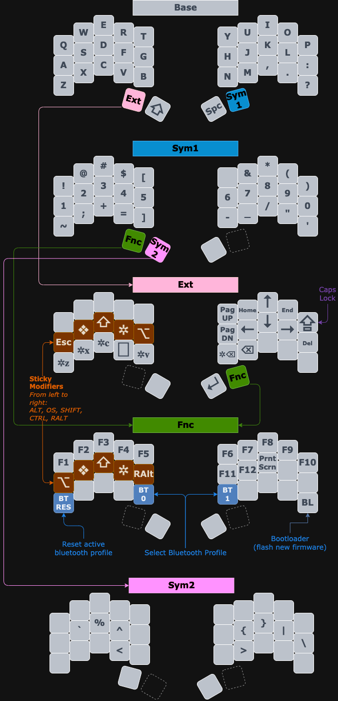

Firmware for: [Urchin Keyboard](https://github.com/duckyb/urchin)

## Getting started

**Are you trying to make your own ZMK firmware?**  
[Here are the steps you need to take.](./GETTING_STARTED.md)

**Do you want to download my keymap?**  

> [!IMPORTANT]
> My firmware only matches the following diagram if the operating system is set to "Italian" keyboard input.

[Download the firmware zip from the latest action run.](https://github.com/duckyb/zmk-urchin/actions/workflows/build.yml?query=is%3Asuccess+branch%3Amaster) Check [the ZMK docs](https://zmk.dev/docs/user-setup#installing-the-firmware) for instructions on how to flash it.

## Keymap Cheat Sheet

This layout is inspired by [Seniply by Stevep99](https://stevep99.github.io/seniply/)

[See it in action on YouTube!](https://youtu.be/IZ83uU0ltaE)

  
  

*This diagram was created using draw.io*  
*Click [HERE](https://viewer.diagrams.net/?tags=%7B%7D&lightbox=1&highlight=0000ff&edit=_blank&layers=1&nav=1&title=carlson-urchin.drawio#R%3Cmxfile%3E%3Cdiagram%20id%3D%22cG3GzfLjlN4xhX_5qKyn%22%20name%3D%22Page-1%22%3E7V1bl9q2Fv4t58HrtGetZFmSr4%2FAQNI2aXJC0iZ96fKAZ4YGMDWezEwfzm8%2FNtjG1pYNDDbbRJqHBGRz07e19WlfNTZYPL4KvdXd22DqzzWqTx81dqVRSohjxf8lI0%2FbEcs2twO34Wya3rQbGM%2F%2B8dNBPR29n039denGKAjm0WxVHpwEy6U%2FiUpjXhgGD%2BXbboJ5%2BVNX3m36ifpuYDzx5j647ffZNLrbjjrU3o2%2F9me3d9knE8vdXll42c3pG6%2FvvGnwUBhiQ40NwiCIto8WjwN%2FnkxeNi%2Fb140qruZfLPSX0SEv%2BPvdO1v%2FZR1cXd%2F%2Fcuf3h38Hf7x6kb7LN29%2Bn%2F7g%2F6bfNnrKpuDhbhb545U3SZ4%2FxDBrrH8XLebxMxI%2F9Nar7cTfzB79%2BLP6N8EySoEkdvp85C1m80QEfvPDqbf0stvSTyHp80EwD8LNp7LeqO8ONi%2BfzeeFceawoZGMh8H9cpp84ObVcDayn%2BaHkf9YGEpn55UfLPwofIpvya6aKVKpqBKWgvywA95Ib7krYJ6Neamo3ebvvEMjfpACcgQ4FIDzu7zguBw4hOKCwwA4Q2nBoawMjou8cAyAzQd5sbE7tnBMAM5HacFhhAMnIwtY4FgAnJ604AA%2BYCOrNRuAM5YXHJ4PmMhqzQHgXEkLDs8H0Jm0C8AZyQsOTwiwV062BxbQeSUtOoARWMiMgEATwR%2FSosNTgpgTIKMDbQSf5UWH5wQutmaDRoKBtOgAUoBNpwk0E%2FwmLzo8K0BfO9BO0JcWHZ4VUB2ZFVDDAWD401s%2Fm7UgjO6C22DpzYe7UW5edve8CYJVOviXH0VPKUTefRSUAfUfZ9Hn%2BLGePv5SGL96LFy4esqeLOOf%2B7n4JHmN%2FtLMnu5etnmWva5OMlIBMqBkuC5jo3he%2B%2BsoDL76RZkhukXtOmlYB%2FfhxK9bEalxJvLCWz%2BqVWwp7AkiteIV%2BnMvmn3zS19EJCybl%2FbC0Hsq3LAKZstoXXjn98lAYT%2BmnNQ6nIdqz%2F0WMzlB3X6DndjmP%2BUEPQNNXsPH6GRNEwZRPLPBMrlunqB5yhrGixc%2BNUXyZY30%2BA9K5M3mr5Udg2Nb1LCQdwxoH9OoNY%2BS6Vp5yxKe1t%2F3id91M1svblIceloigJa3SMBNb1j7t4Efj9%2FPkvW0CP6a8XdoCacDr%2FNWq3nyuskGiqNeugxitbfvlcmL9c23X2%2BkKvnuTF89bi5Y%2Bftbt%2Bn%2F8%2BzXVk%2FDIW80pJpjaz07e8cYqO2blj8oHt5OeTbc3GpimZCnq4nt09ad2seZU14zloG8ZqDZ8ou0LMuwy%2Bige2MItFt%2BkhYdk3DoYDsyM%2BkooPOTvOiYZXSwQwAoNFu%2Bkxcct2tLB5ot30uLjsWRAnRvGYVmy9fSogNIAbZDhkKz5c%2FSogNIAbYzk0Kz5S%2FyomN2TbNBY88bedHhWQH62hEYcJi88WeAF2A7zCg0FvwqLTo8L8B3yUBjwVtp0QG8ANudyaCxQJM4GAAwA2zdxqC94KW86PDMAH31QHuBxuQN4eSZAXoYGoMWg%2FFqcjI%2BBbfPC97vc1GAGXzcILbfh0EjwvhpkbnvrsPMc0caxbBBTzi59ogfzzj0hOu6NeyNIOrtecINTl2ie8IZNELk0GbIxkj5BXftdaWvdjddyQrcA%2F8BYTP2MxZkAyAx3XlplmCyoNLM086LMLHWYILWiH9Ju6fxodVGxuDRFpHAGpF9mIz4cOE%2BzGXI%2BEBrhJZ5LiTEhw%2BvZjb2%2BoH2CC3zXciIj92x9WMILBKmCrHO9x%2BdIOMDLRKns%2FFLRQewAxNZuxnQIkHlRYfjBgbD1m3QHqGYQWeYtQGND4oXdGftQOOBKS06gBUY2KwA2gz%2BJy06gBW42JpNFMEgL6cGvMDG1m0im4G8%2BABmgM6qBTaDFCUp8eG5Afb6MUU2A3nxAezAQWYH1IQmApWWzSzSc6kwLTu%2FUikNe9Oysynfn5btpOwAOS2bUyqmRYpyt%2B92l5whKduEtq%2FRstF4gpNc0RWOZU7vWLrnbt4WSB29sq1NsnbrSdkmRY8ZdVE10lajYOskgdTkuxKQjitb79v0NJ1ED9RJ1HE6oZO4g5zp0FqdxFfmpOeoFJFN6r6YmdPtwDXp7i3oqamj6zGxFBUtMXXdaEVP8YnwZmZ1QmO20GIsLa3lQ9vRXWEmNBjnBTG2%2F0qLFR%2Foju5WNqH5%2BD%2FyosOFuaMHZZjQfPyDvOi4XVs70Hz8o7To8EHu6G5LExqPLWnRARwB2zFmQtOxLS06PCtAdypb0HAMC0hKg47ZMc1mQXMbtNpIg47btbUD7Q7yhqEDVoDtsrSg4eCFtOgAVoDtELOg5eBPadEBrADbnWyJ8tTkTesFvABdt0FrQbEmrKww8QQBfRlBs8G%2FpUUHEATsmEBLFHN2IjjfbWI8uh%2FIgmaERtFqMO5g%2B8ehtQyW8e2CQJfNX3Ila0OdiM36qx9N7tInZXBv5956nV6Zeuu7NhPm0aMUbGieAAnz46cFwUuYf1b1g0x46voCNAAnTK1nBlS6582tJ7qIu0i6J%2FJx8lYWJYTX8k%2FUq0FWdLiYLctC3gOJ3gJluVR0%2BBh5y0RfOy1QlItFx%2B7a2hF0M5UWHT4%2B3sI%2BKRNBN9Ph%2BvTA4ucCVAbi5ubasSYiVje13WtRdyemx3NsnYMy2Axb7QlancrV3ok6NV2Z3CvNtdpqv%2FQdijfHuWwdfd8QBaAq8dbETceUeB9HWtEPfIJmu0q8d9p7oPWpEu%2Fnsv4OaO%2FqiptKvDVnoPVMJd7PPTbZBP3YJHQEyyTedR1RN9r7n67JN%2FbhH5wgbXQOInuD4P1S%2FKikeM9BEdtBTQQte5UUl6V4oqS4%2FjzYAWueyIkhlRRnhHl74SGd9eSSsaGbYvnuXWn9oRLvPedBdCUt6A0tmXjvVdLflBTvOfaZ2Mc%2BCr1lJ6PTTg2e58XClSEsRcaVQt6KsXClkLkmdBdPMF0XG3WRo6051C86XpWvW%2BJgd94igmbd773bYlWaqq1mp6yJUaGsP71vVBsbF4Q0n8qEH7sgaPz9On7vRhHaF5LaJYT4dCb82B9B82%2B5WB%2BjdV4AS3OJIn31OV%2F44YWCHunD5VReLeN2TsvIbsau1zK21uspLVOfFIcfDyLoJd8cbb1qti39JdNWfN%2BxoC%2B9UlclUqQrdVXP7PHjezJ%2FiRLiKiFmSoj3MHv0PZeJzLlKiAtCTJUQ159%2BOqCJRdbpLWjJbCWge5OyDGfzW4D9AHJJqsilPy9IyfYzJZcS%2FniBH17AqrMpUinZLwB2LABULyiSoo9%2BGYQLby7QJN%2B1Qj0%2Bdl2q2XiWhFUFTPcrtUztVCudVHEQRvemM%2BlTYGrpFyfyin6JDsLogU1M5OKSFR2zc7RHFb2pPrrgrx1V9Kb6yICeHcJkj6vPrSPHRSQ7ltZvLbnvuy10iB44RjM%2BXEDnjI35ssdfCo%2F3tOUj2qW3CiUs9YVh9Ao9UTtCL17DHTmbLI3ZpZacfLFL%2FADf7J2LET6PEcCylTqWPG5lfDyq69QUrr6RrouysNutY2lRyErOXMdS0Ao322yns2%2B89ec6GxhHs8nX5Le9Daazm5kfrgtb9LXAaCR4M8GQyOI0ywZGYbCIP3Hu3yTmrw0LCXMOkX%2FQTPDhFYasBr5T783HLU16N97%2BP3790ygdGnz88Gb76MPmtpO%2FIreAYrGLyqukLNZpfoIgZcGbz24TnbiZStZPRHg28ea9dHgxm04327FoUZaXbSmpoTKP4YDVy%2BDaG40cXW8oDYLo%2B%2FkREa08t72VJ%2FI08YxpOe2F4WaCJ8nkziZHq8W6iX1uS%2BJd%2B2Na7H%2Bccysh0eKyYXgNvB%2Ft%2Ffzn8F7pWaG%2BvfynIB%2BmQDyysePaF4OGw0QvbwwO5cRu%2B9vTV%2B0kD7yRwWXimvw2v50a8EbHNlTOA%2Bxy87fOrYgWOiQTQRfdUSYc8tk4%2BAoYLrqNQ9BIdySvDYqv7eCiWwgFzXNH8JguCz581QIX3b4uaJ87MuTFx%2B7c%2BoEW9pEpLT58QrmL7gIXNMvr5wevE4P%2BPwzHjSJtHIF0GVFz4AwGPRGHNkzLcQWEX3d1f%2FOBrXOQmMhiK1FBTz5plyhPQYhOsXWosCmfpPDwDIToBH31KBd%2FJQHpwuqBDKSxHU5X%2B9tejkN07HbNRNBMbGRJu0b5OEx8EmpDj8rIlhYfPsQQ%2FxBnU4iPIy8%2BXJAhvhHEFhh5XXnxcTu3fgRGXtIsd7gkgPhIQ3wrvC2w8hJ53SSAIbjoDEFg5s3aT0kIEKAIDrqKg6es9%2BEm6amJc9Z4Ei4bBfuYoxY62DzfwFeXqhtpNdvAX4qqG2kl1eiAudCBxojG7FHNUpbvwx7Fk5kO2KOcFqo4X%2BoK5alMByzGDjR3yAuP2T0FKqokISs8bvdWDzR29N9ICxAkIOjefqcFd%2FJ3mxVIdBe7nrzTgn%2B5pSyvy236wOeEET07RuHhLgidEyT4ISSFHZC0d9akMFeHOvXMSWEuPNXJlauu2s02twnBEEF00u3KXqmyvlv4leZaSr6fneaBbjN1RUd%2BJd6Z%2Bra1nq3E%2B9lZMugOG7e6%2BKYS7z31MpV470sywtfe1XUck1nJ81F686gAc%2FGSgnl%2FrhJ6EIh7gOGqgfR%2FA85yW%2Bn%2F9XWWOpX%2Bn1G2jqb%2F5yaAU9P%2Fbb58RUvp%2F0RnZ8j%2FpwZ0CZ%2Bxpli6MA4qdnHeqmKMue5IWFUsv%2FL8ZUXZwcvK6lZVMWoIVGrH5eVIVXzZ8uIcqobPJC%2BCDiZjf55wI6r346EoCOLdgOrvwyDmOrA16ukVmSbxdPvxeCdqMtVJThOcjPKmb0IseLgklpvdVtx6%2BQo5DWoNGMx%2BDq2Ra4Ddov9SvHZuDcCx%2BannOzeTEzUDPXgnYR3TDNCk9sFf%2B4li8Cabzy%2FEvG1PYdcFhbFSCqMBhUGy%2FTxXFwZ5CY%2FreZnykrMs1zUtCAesAYJGM%2BoPYU0riwZObYcrhfzOrigFA9bm6Sju5z2ODAZV8pJfOUFeDHboJkK7dhyBhuuBt1rDreNNMPl6wF7R3T0A7ldVItLAtmBxMdEWdkg0FdTBA3DKEjMINm2K3aiSCsrgyQuPw8OD3YCeCqrgSQsPpTw82BG3VFAET154rO6tHpXOWAiu5OGx0amBymespgYMu%2FgIzeyPRXgsaA%2BUBiGeHTDsBs3UEsVuyluEFRIEdHqd7YlFhMyhvAjxHKEDa0glHVZzBEawOYKqYFvHEbDjT6mqYFtHELDrk1FVwbaGHXSAYYvMB2nQ8xw1ehUdLEAU8NeSMibUEAXsUrPUasGYUEimbjCXGmE1gZ0JuzEmFVRubhKuBksVXG7qO%2BNL6hvonZAFBaGlVaIGX1If3yIrqActLTwmX%2B4e358hKActLzx8Kj2%2BN1BQDVpeePhuOx1YPcpWUahexcODbioXVIKWFh5ADfANsYI60Jotr4ECsAN8T4aoeLN9JS9CgCDgqziBjcIeyIsQzxHw15CghrNmyosQoAn4NnNVYrmOJqCbYYUlllOXBm5BDmywIGNAd2mogss1dKEDqk7ZE2q4Av7qUfaEGqKAHprSdnXly66GzYcS4buGBFWRG8VLVcNO4ANqFN0T7ECzxfhpAbFvpRw2V9fB0XWbiUDsmbpu1JW%2FLkvM6UAxXecLguRlPtCKYVNhNdXm1qhaogmk%2FBJFL1hPhVVGm4P9ondSBvqAnLGvxODj%2BpMR%2Frb6uO59Nt2HEfv5z48vGMDmmEoMCRZnL%2FR1ZJmfimo8cF1PHP%2B6tjlBscSCcDIPr9%2BVHtbOX2Ch7nsXe%2FUEQTQPvKkfwiILP9zECi0pzrP0H%2BJ%2Fb2bh4iGerB%2BBJKkiPUcdWnndQAQ2hYqaXs9QD%2FHTMEiKIOfXXsWzd%2Fc2mPrJHf8H%3C%2Fdiagram%3E%3C%2Fmxfile%3E) to view a copy that you can edit*
